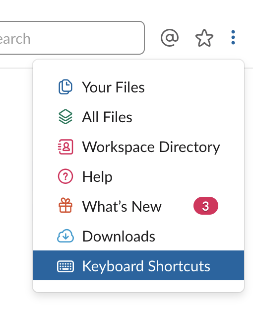

# Slack Pro Tips

---

## Agenda

* Channels
* Conversations
* Notifications
* Posts
* Special Commands & Integrations

---

# Channels

---

## Private vs Public

Note:

Private channels can't be made public. So default to public unless really necessary.

---

## Projects vs Interests

Note:

Specific vs. cross-cutting.

---

## Channel Topics

---

## Pinning Messages

(vs Starring Messages)

Note:

Pinning messages makes them available under a shortcut for everyone who visits a channel.
Sort of an FAQ for visitors old and new.

---

## What channel to use when

_Announcements vs General vs Instagram vs Standup_

---

---

# Conversations

---

## Threading

---

## Scope

- In-channel comms
- Private messages (DMs)
- Group DMs

OR: When not to use Slack

Note:

Most of your comms should go in channels.

---

# Notifications

- notifications
- muting

---

# Status

--- 

# Posts
- Editing ⬆️
- Formatting
  - Quoting
- `:emoji:`
- Reacting
    `+:100:`

Note:
Hit up 

---

## Saving a Post ⭐️

---

# Slack Magic @fa[magic]

---

## / Commands

---

## Reminders ⏰

---

## Integrations

- Giphy
- Github
- Trello
- GDrive

---

# ⌘ + /
## Keyboard Shortcuts

---

http://github.com/arowla/slack-pro-tips

---
