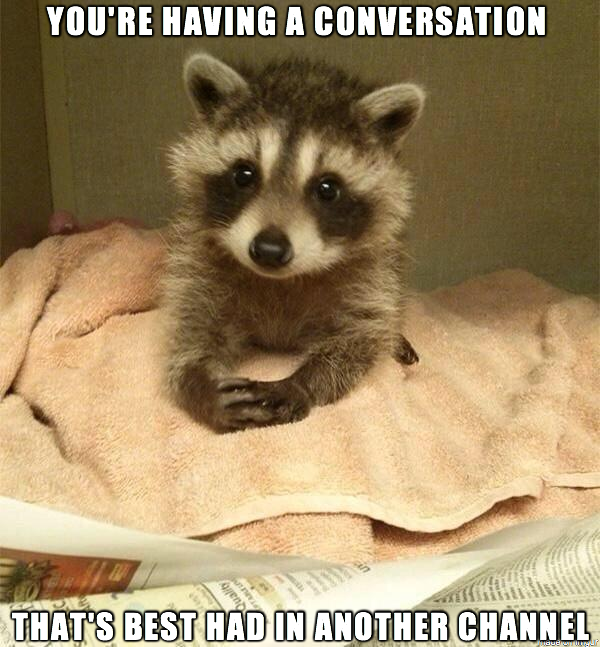

# Slack Pro Tips

---

## Agenda

* Channel management
* Conversation management
* Notification management
* Post management
* Special Commands & Integrations

---

# Channel management

---

## Projects vs Interests

---

## Pinning Messages

(vs Starring Messages)

---

## What channel to use when

_Announcements vs General vs Instagram vs Standup_

---

## When people are in the wrong channel

---

# Conversation management

---

## Threading

---

## When to use:

- In-channel comms
- Private messages (DMs)
- Group DMs

OR: When not to use Slack

---

# Notification management

- notifications
- muting
- setting your status

--- 

# Post management
- Editing
- Quoting
- Starring

---

# Special Commands & Integrations

---

## / Commands

---

## Reminders

---

## Integrations

- Giphy
- Github
- Trello
- GDrive

---

http://github.com/arowla/slack-pro-tips

---
